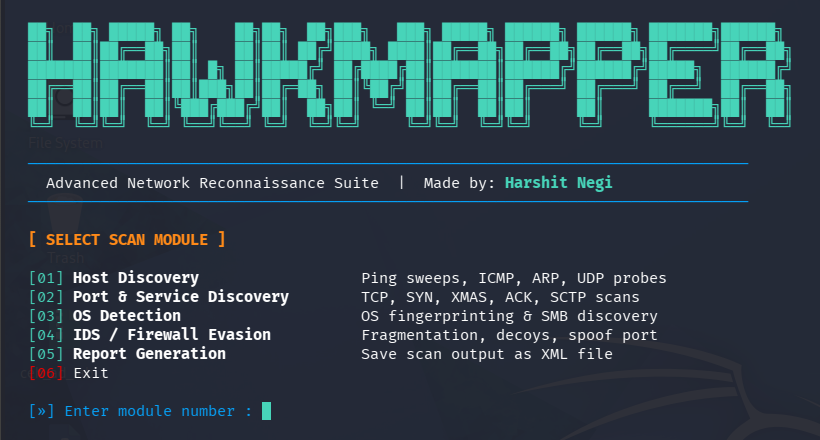

<h1 align="center">
  
</h1>

<p align="center">
  <b>Advanced Network Reconnaissance Suite for Penetration Testers</b>
</p>

<p align="center">
  
  
  
  
  
</p>

<p align="center">
  <a href="#-features">Features</a> •
  <a href="#-installation">Installation</a> •
  <a href="#-usage">Usage</a> •
  <a href="#-modules">Modules</a> •
  <a href="#-html-report">HTML Report</a> •
  <a href="#-disclaimer">Disclaimer</a>
</p>

---

## ⚡ Features

- 🔍 **Host Discovery** — 8 scan types (ICMP, UDP, SYN, ACK ping sweeps)
- 🚪 **Port & Service Discovery** — 9 scan types (TCP, SYN, XMAS, Maimon, SCTP, Zombie)
- 💻 **OS Detection** — TCP/IP fingerprinting + SMB OS discovery script
- 🛡️ **IDS / Firewall Evasion** — Fragmentation, Decoys, Source Port Spoofing, MTU tricks
- 📊 **HTML Report Generation** — Professional dark-theme browser report with custom analyst name
- 🎨 **Clean CLI Interface** — Color-coded, menu-driven, easy to use
- 📁 **Smart Save** — Reports save in whichever directory you run the tool from

---

## 🛠️ Installation

**Requirements:**
- Kali Linux / any Debian-based Linux
- Python 3.x
- nmap

```bash
# Install nmap if not present
sudo apt update && sudo apt install nmap -y

# Clone the repository
git clone https://github.com/harshithnegi/Hawkmapper.git

# Enter directory
cd Hawkmapper

# Give execute permission
chmod +x hawkmapper.py
```

---

## 🚀 Usage

```bash
sudo python3 hawkmapper.py
```

> ⚠️ `sudo` is required for SYN scans and OS detection

---

## 📦 Modules

```
┌─────────────────────────────────────────────────────────┐
│                    HAWKMAPPER v1.0                      │
├────┬──────────────────────────┬────────────────────────-┤
│ 01 │ Host Discovery           │ Ping, ICMP, UDP, ARP    │
│ 02 │ Port & Service Discovery │ TCP, SYN, XMAS, SCTP    │
│ 03 │ OS Detection             │ Fingerprint + SMB       │
│ 04 │ IDS / Firewall Evasion   │ Decoy, Fragment, MTU    │
│ 05 │ HTML Report Generation   │ Dark-theme browser      │
│ 06 │ Exit                     │                         │
└────┴──────────────────────────┴─────────────────────────┘
```

### Module 01 — Host Discovery
| # | Scan Name | nmap Flag |
|---|-----------|-----------|
| 1 | UDP Ping Sweep | `-sn -PU` |
| 2 | ICMP Echo Ping Sweep | `-sn -PE` |
| 3 | ICMP Echo Range Sweep | `-sn -PE` (range) |
| 4 | ICMP Timestamp Ping | `-sn -PP` |
| 5 | ICMP Netmask Ping | `-sn -PM` |
| 6 | TCP SYN Ping | `-sn -PS` |
| 7 | TCP ACK Ping | `-sn -PA` |
| 8 | IP Protocol Ping | `-sn -PO` |

### Module 02 — Port & Service Discovery
| # | Scan Name | nmap Flag |
|---|-----------|-----------|
| 1 | TCP Connect Scan | `-sT -v` |
| 2 | SYN Stealth Scan | `-sS -v` |
| 3 | XMAS Scan | `-sX -v` |
| 4 | Maimon Scan | `-sM -v` |
| 5 | ACK Scan | `-sA -v` |
| 6 | SCTP INIT Scan | `-sY -v` |
| 7 | Idle / Zombie Scan | `-sI -v` |
| 8 | SCTP COOKIE-ECHO Scan | `-sZ -v` |
| 9 | Aggressive Full Scan | `-A` |

### Module 03 — OS Detection
| # | Scan Name | nmap Flag |
|---|-----------|-----------|
| 1 | Aggressive OS + Service Detect | `-A` |
| 2 | OS Fingerprinting | `-O` |
| 3 | SMB OS Discovery Script | `--script=smb-os-discovery` |

### Module 04 — IDS / Firewall Evasion
| # | Technique | nmap Flag |
|---|-----------|-----------|
| 1 | Packet Fragmentation | `-f` |
| 2 | Source Port Spoof | `-g 80` |
| 3 | Source Port Option | `--source-port 80` |
| 4 | Custom MTU (8 bytes) | `--mtu 8` |
| 5 | Decoy Scan (10 random IPs) | `-D RND:10` |

---

## 📊 HTML Report

Module 05 generates a **professional dark-theme HTML report** directly in your current directory.

**Report includes:**
- Summary cards — Target, Scan Time, Hosts Found, Open Ports
- Per-host breakdown — IP, Hostname, OS Detection, full Port Table, NSE Script Output
- Custom **Analyst Name** printed on the report
- Color-coded port states (open / filtered / closed)

```bash
# Run the tool
sudo python3 hawkmapper.py

# Select Module 05
# Enter target, filename, analyst name
# Scan completes → open report:
firefox hawkmapper_report_20250607_143022.html
```

---

## 📁 File Structure

```
Hawkmapper/
├── hawkmapper.py       # Main tool
├── README.md           # Documentation
└── assets/
    └── banner.png      # Screenshot
```

---

## ⚠️ Disclaimer

> This tool is developed for **educational purposes** and **authorized penetration testing only**.  
> The author is **not responsible** for any misuse or illegal activity performed using this tool.  
> Always obtain **written permission** before scanning any network or system.  
> **Unauthorized scanning is illegal.**

---

## 👤 Author

**Harshit Negi**
- 🐙 GitHub: [@harshithnegi](https://github.com/harshithnegi)

---

<p align="center">🦅 Made with ❤️ for the cybersecurity community</p>
